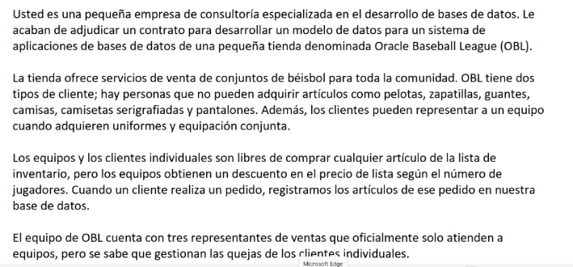
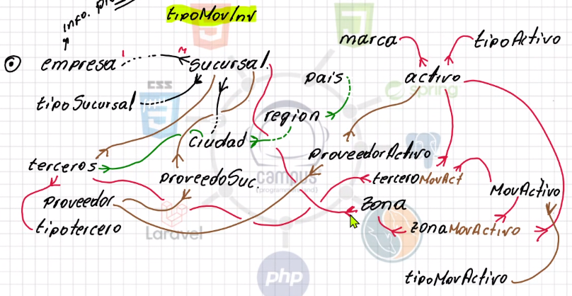
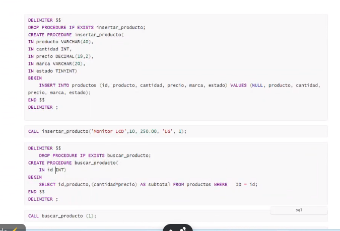

# mySQLjholver
Base de datos con jholver

## NORMALIZACION

EJERCICIO #1 : Realizar modelamiento conceptual y logico.



### modelamiento conceptual:

#### Entidades:
    - personas
    - equipos
    - vendedor
    - pedido
    - item
    - inventario

EJERCICIO #2 INVENTArio de campuslands



### COMANDOS MYSQL

```
mysql -p -u campus2023
```
Crear base de datos
```
CREATE DATABASE [nombre]
```
Pagina para aprender personlalmente : 3WSCHOOLS

```
CREATE TABLE pais (
    id INT AUTO_INCREMENT,
    nombre VARCHAR(50),
    CONSTRAINT PK_Pais_id PRIMARY KEY (id)
);

CREATE TABLE region (
    id INT AUTO_INCREMENT,
    nombre VARCHAR(50),
    fkidpais INT(11),
    CONSTRAINT PK_Region_Id PRIMARY KEY (id),
    CONSTRAINT FK_Pais_Regin_Id FOREIGN KEY (fkidpais) REFERENCES pais(id) 
);

CREATE TABLE ciudad (
    id INT AUTO_INCREMENT,
    nombre VARCHAR(50),
    fkidregion INT(11),
    CONSTRAINT PK_Ciudad_id PRIMARY KEY (id),
    CONSTRAINT FK_Ciudad_Regin_Id FOREIGN KEY (fkidregion) REFERENCES region(id) 
);
```

### Consultar estructura de tabla
```
mysql> describe ciudad;
```
### Insertar valores 
```
INSERT INTO pais (nombre) VALUES
    ('Colombia'),
    ('Peru'),
    ('Argentina');
INSERT INTO region(nombre,fkidpais) VALUES
    ('CaribeA',1),
    ('CaribeB',1),
    ('CaribeC',1),
    ('Nose1',2),
    ('Nose2',2),
    ('Nose3',2),
    ('Menos1',3),
    ('Menos2',3),
    ('Menos3',3);

INSERT INTO ciudad(nombre,fkidregion) VALUES
    ('Santa Marta',1),
    ('Aguachica',1),
    ('Cartagena',1),
    ('Rio negro',2),
    ('Sucre',2),
    ('Haiti',2),
    ('Yopal',3),
    ('Meta',3),
    ('Villavicencio',3);
    ('Zona2Ciudad1',4),
    ('Zona2Ciudad2',4),
    ('Zona2Ciudad3',4),
    ('Zona2Ciudad1',5),
    ('Zona2Ciudad2',5),
    ('Zona2Ciudad3',5),
    ('Zona2Ciudad1',6),
    ('Zona2Ciudad2',6),
    ('Zona2Ciudad3',6),
    ('Zona3Ciudad1',7),
    ('Zona3Ciudad2',7),
    ('Zona3Ciudad3',7),
    ('Zona3Ciudad1',8),
    ('Zona3Ciudad2',8),
    ('Zona3Ciudad3',8),
    ('Zona3Ciudad1',9),
    ('Zona3Ciudad2',9),
    ('Zona3Ciudad3',9);

```
### Primeras consultas
```
    SELECT p.id, p.nombre as 'Nombre del pais', r.nombre AS 'Nombre de la region'
    FROM pais AS p, region AS r
    WHERE p.id = r.fkidpais;

    SELECT p.id, p.nombre as 'Nombre del pais', r.nombre AS 'Nombre de la region'
    FROM pais AS p 
    JOIN region AS r ON p.id = r.fkidpais;
```
### Operadores logicos/Comparacion

LOGICOS ->> AND OR NOT
COMP > < >= <= <> LIKE BETWEEN
like '%v%'
like '%v'
like 'v%'

###  Eliminar registro de tabla por IDS
```
DELETE FROM pais WHERE id = 4;
```

###  Modificar registro de tabla por IDS
```
    UPDATE pais SET nombre = 'Nombre modificado'
    WHERE id = 3;
```

### Consultas: selecionar las regiones quie inician con a del pais de colombia

```
    SELECT R.nombre as 'Nombre de las regiones'
    FROM pais as P
    JOIN region as R ON P.id = R.fkidpais
    WHERE P.nombre = 'Colombia' AND R.nombre LIKE '%a%';
    
```


CREATE TABLE departamentos (
    id INT PRIMARY KEY AUTO_INCREMENT, 
    nombre VARCHAR(100) NOT NULL, 
    ubicacion VARCHAR(255) 
);

CREATE TABLE empleados (
id INT PRIMARY KEY AUTO_INCREMENT, 
nombre VARCHAR(50) NOT NULL, 
apellido VARCHAR(50) NOT NULL, 
fecha_nacimiento DATE, 
fecha_contratacion DATE, 
salario DECIMAL(10, 2) NOT NULL, 
departamento_id INT, 
email VARCHAR(100) UNIQUE, 
telefono VARCHAR(15), 
direccion VARCHAR(255), 
ciudad VARCHAR(100), 
estado VARCHAR(100), 
pais VARCHAR(100), 
codigo_postal VARCHAR(10), 
FOREIGN KEY (departamento_id) REFERENCES departamentos(id) 
);

### SUBOCONSULTAS ESCALARES: retorna un unico valor

```

```

### SUBOCONSULTAS COLUMNA UNICA: retorna una campo completo
### SUBOCONSULTAS VARIAS COLUMNAS:  
### SUBOCONSULTAS VARIAS CORRELACIONADAS: 

## PROCEDIMIENTOS

Have you ever considered leaving campuslands?
Do you enjoy spending time in campuslands?
How long have you been studying at campuslands?
Can you imagine Campuslands giving out food coupons?

## PRODECIMIENTOS
1. Ejercicio 01

    ```sql
        CREATE DATABASE tienda01;

        USE tienda01;

        CREATE TABLE IF NOT EXISTS productos (
            id int NOT NULL AUTO_INCREMENT,
            producto VARCHAR(40) NOT NULL,
            cantidad INT NOT NULL,
            precio DECIMAL(19,2) NOT NULL,
            marca VARCHAR(20) NOT NULL,
            estado tinyint,
            primary key(id)
        );

        DELIMITER $$
        DROP PROCEDURE IF EXISTS insertar_productos;
        CREATE PROCEDURE insertar_productos(
            IN producto VARCHAR(40),
            IN cantidad INT,
            IN precio DECIMAL(19,2),
            IN marca VARCHAR(20),
            IN estado TINYINT
        )
        BEGIN
            INSERT INTO productos (id, producto, cantidad, precio, marca, estado)
            VALUES (NULL, producto, cantidad, precio, marca, estado);
        END $$
        DELIMITER ; -- PARA RESTAIRAR EL DELIMITADOR PRODEFECTO DE SQL ";"


        /*llamado del procedimiento*/
        CALL insertar_productos('Monitor LCDS', 10 , 250.00, 'LG', 1);

    ```
1. Ejercicio02

    

1. Ejercicio03: con verificacion

    ```sql
    DELIMITER $$
    DROP PROCEDURE IF EXISTS insertar_productos_verify;
    CREATE PROCEDURE insertar_productos_verify(
        IN producto VARCHAR(40),
        IN cantidad INT,
        IN precio DECIMAL(19,2),
        IN marca VARCHAR(20),
        IN estado TINYINT
    )
    BEGIN
        DECLARE mensaje VARCHAR(100);
        
        INSERT INTO productos (id, producto, cantidad, precio, marca, estado)
        VALUES (NULL, producto, cantidad, precio, marca, estado);
        
        IF ROW_COUNT() > 0 THEN
            SET mensaje = 'EL registro se ha creado correctamente';
        ELSE
            SET mensaje = 'Error al crear el registro';
        END IF;
        
        SELECT mensaje AS 'mensaje';
    END $$
    DELIMITER ; -- PARA RESTAIRAR EL DELIMITADOR PRODEFECTO DE SQL ";"

    CALL insertar_productos_verify('Alpha PLus', 30, 480.00, 'BIomax', 1);
    ```

1. Eliminar productos

    ```sql
        DELIMITER $$
        CREATE PROCEDURE eliminar_producto (
            IN producto_id INT
        )
        BEGIN
            DECLARE mensaje VARCHAR(100);
            
            DELETE FROM productos WHERE id = producto_id;
            
            IF ROW_COUNT() > 0 THEN 
                SET mensaje = CONCAT ('El producto con ID', producto_id, 'ha sido eliminado exitosamente.');
            ELSE
                SET mensaje = 'No se encontro ningun producto con el ID proporcionado';
            END IF;
            
            SELECT mensaje AS 'Mensaje';
        END $$
        DELIMITER ;
    ```

1. Listar productos

    ```sql
        DELIMITER $$
        DROP PROCEDURE IF EXISTS listar_productos;
        CREATE PROCEDURE listar_productos()
        BEGIN
            SELECT * FROM productos;
        END $$
        DELIMITER ;
        CALL listar_productos();
    ```

1. Cantidad de productos por marca
    ```sql
        DELIMITER $$
        DROP PROCEDURE IF EXISTS obtener_cantidad_productos_por_marca;
        CREATE PROCEDURE obtener_cantidad_productos_por_marca(
            IN marca_busqueda VARCHAR(20)
        )
        BEGIN
            DECLARE cantidad_productos INT;
            SELECT COUNT(*) INTO cantidad_productos
            FROM productos
            WHERE marca = marca_busqueda;
            
            SELECT cantidad_productos AS 'Cantidad de productos'
        END $$
        DELIMITER ; -- PARA RESTAIRAR EL DELIMITADOR PRODEFECTO DE SQL ";"
    ```

1. Filtrar por campo en una tabla

    ```sql
        DELIMITER $$
        DROP PROCEDURE IF EXISTS obtener_cantidad_productos_por_producto;
        CREATE PROCEDURE obtener_cantidad_productos_por_producto(
            IN id_producto VARCHAR(20)
        )
        BEGIN
            DECLARE cantidad_disponible INT;
            SELECT productos.cantidad INTO cantidad_disponible
            FROM productos
            WHERE id = id_producto;
            
            SELECT cantidad_disponible AS 'Cantidad de productos'
        END $$
        DELIMITER ; -- PARA RESTAIRAR EL DELIMITADOR PRODEFECTO DE SQL ";"
    ```

1. Procedimiento con tablas temporales
    ```sql
        DELIMITER $$
        DROP PROCEDURE IF EXISTS obtener_total_registros_por_marca_temp;
        CREATE PROCEDURE obtener_total_registros_por_marca_temp()
        BEGIN
            -- Crear tabla temporal
            CREATE TEMPORARY TABLE IF NOT EXISTS temp_resultados (
                marca VARCHAR(20),
                total_registros INT
            );
            -- Insertar los resultados en la tabla temporal
            INSERT INTO temp_resultados(marca, total_registros)
            SELECT marca, COUNT(*) AS total_registros
            FROM productos
            GROUP BY marca;
            -- Seleccionar los resultados de la tabla temporal
            SELECT * FROM temp_resultados;
            -- Eliminar la tabla temporal despues de usarla
            DROP TEMPORARY TABLE IF EXISTS temp_resultados;
        END $$
        DELIMITER ;

        call obtener_total_registros_por_marca_temp();   
    ```