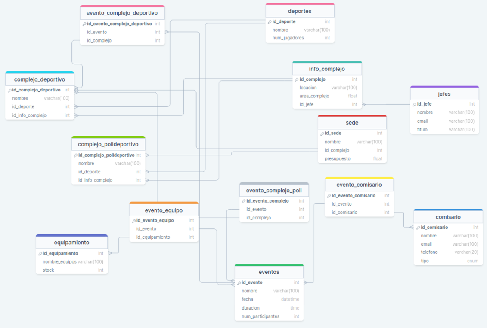
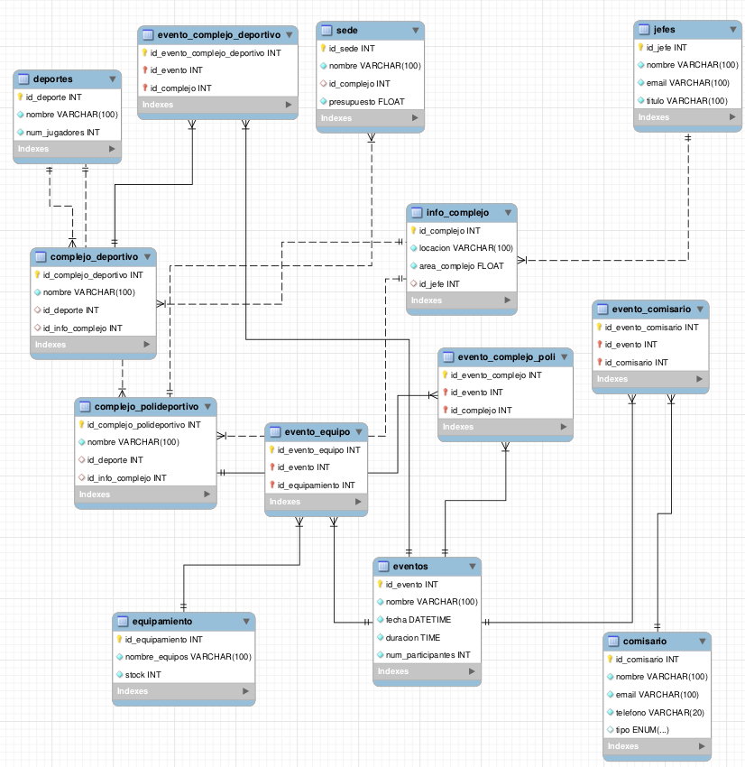

# Los Olímpicos
Surge la problemática de optimizar el uso de espacios en los complejos polideportivos. Dada la subdivisión de complejos deportivos en aquellos destinados a un único deporte y los polideportivos, es esencial garantizar una distribución eficiente de las áreas designadas para cada deporte en los complejos polideportivos.

La pregunta clave es, cómo maximizar la utilización de los espacios disponibles en los complejos polideportivos, considerando las diferentes áreas destinadas a distintos deportes con indicadores de localización específicos. La optimización deberá tener en cuenta la variedad de deportes que se celebran en un mismo complejo polideportivo, garantizando la eficacia en la organización de eventos y minimizando posibles conflictos de programación.

Además, la gestión de eventos en cada complejo añade complejidad al escenario. ¿Cómo asegurar que los eventos programados en una sede no entren en conflicto con la disponibilidad de áreas específicas en los complejos polideportivos? Esto implica coordinar fechas, duraciones, participantes y comisarios de manera eficiente, evitando superposiciones y garantizando un flujo adecuado de las actividades deportivas.

La necesidad de mantener una lista actualizada de comisarios y su participación en eventos plantea otra dimensión de la problemática. ¿Cómo gestionar eficazmente la asignación de comisarios a eventos específicos, considerando sus roles como jueces u observadores, para asegurar una cobertura adecuada en cada competición?

Finalmente, la gestión del equipamiento necesario para eventos y mantenimiento también representa un desafío. ¿Cómo garantizar que cada evento cuente con el equipamiento requerido y que se realice un mantenimiento efectivo de las instalaciones sin afectar la realización de competiciones?

La problemática central radica en la optimización integral de los recursos y espacios en las sedes olímpicas, particularmente en los complejos polideportivos, para lograr una gestión eficiente y exitosa de los eventos deportivos.

