# DbGarden Taller
Crear repositorio con la solucion de cada requerimiento de base de datos. El repositorio debe contener Readme con el enumciado de la consulta, la solucion y el resultado obtenido.  Asegurese que todas las consultas arrojen resultados.
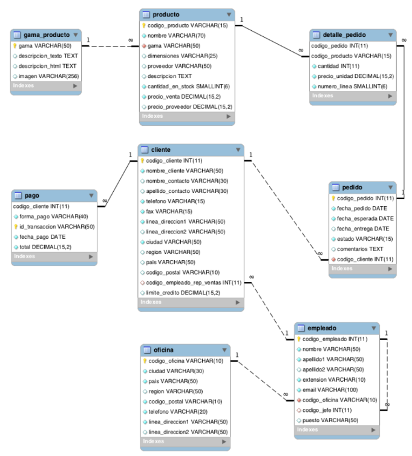

## CONSULTAS SOBRE UNA TABLA

1. Devuelve un listado con el código de oficina y la ciudad donde hay oficinas.
    ```SQL
        SELECT O.codigo_oficina as oficina, C.nombre_ciudad as ciudad 
        FROM oficina AS O
        INNER JOIN ciudad as C ON C.codigo_ciudad = O.ciudad;
    ```   
    

1. Devuelve un listado con la ciudad y el teléfono de las oficinas de España.
    ```SQL
        SELECT
            T.oficina as Oficina ,T.telefono as Telefono
        FROM
            telefono AS T
        WHERE
            T.oficina IN (SELECT  DISTINCT O.codigo_oficina
        FROM pais as P
        JOIN region as R ON P.codigo_pais = R.pais
        JOIN ciudad as C ON  R.pais = C.region
        JOIN oficina as O ON C.codigo_ciudad = O.ciudad
        WHERE P.nombre_pais = 'España');
    ```  
    

1. Devuelve un listado con el nombre, apellidos y email de los empleados cuyo
jefe tiene un código de jefe igual a 7.

    ```SQL 
        SELECT  CONCAT(E.nombre, ' ', E.apellido1 , ' ', E.apellido2) AS Nombre, E.email as Correo
        FROM empleado as E
        WHERE E.codigo_jefe = 7;
    ```
    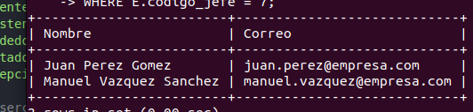

1. Devuelve el nombre del puesto, nombre, apellidos y email del jefe de la
empresa.

    ```SQL
        SELECT P.puesto as Cargo, CONCAT(E.nombre, ' ', E.apellido1 , ' ', E.apellido2) AS Nombre, E.email as Correo
        FROM empleado as E
        INNER JOIN puesto as P ON E.puesto = P.codigo_puesto
        WHERE P.codigo_puesto = 5; 
    ```
    

1. Devuelve un listado con el nombre, apellidos y puesto de aquellos
empleados que no sean representantes de ventas.

    ```SQL
        SELECT CONCAT(E.nombre, ' ', E.apellido1 , ' ', E.apellido2) AS Nombre, P.puesto as Cargo
        FROM empleado as E
        INNER JOIN puesto as P ON E.puesto = P.codigo_puesto
        WHERE E.puesto <> 2;
    ```
    

1. Devuelve un listado con el nombre de los todos los clientes españoles.
    ```SQL
        SELECT  CC.nombre_cliente as Cliente
        FROM pais as P
        JOIN region as R ON P.codigo_pais = R.pais
        JOIN ciudad as C ON  R.pais = C.region
        JOIN cliente as CC ON C.codigo_ciudad = CC.ciudad
        WHERE P.nombre_pais = 'España';
    ```
    

1. Devuelve un listado con los distintos estados por los que puede pasar un
pedido.

    ```SQL
        SELECT * 
        FROM estadoPedido;
    ```
    

1. Devuelve un listado con el código de cliente de aquellos clientes que
realizaron algún pago en 2008. Tenga en cuenta que deberá eliminar
aquellos códigos de cliente que aparezcan repetidos. Resuelva la consulta:
    1. Utilizando la función YEAR de MySQL.

        ```SQL
        SELECT DISTINCT P.cliente as Cliente
        FROM pago as P
        WHERE YEAR(P.fecha_pago) = '2008';
        ```

    1. Utilizando la función DATE_FORMAT de MySQL.

        ```SQL
            SELECT DISTINCT P.cliente as Cliente
            FROM pago as P
            WHERE DATE_FORMAT(P.fecha_pago, '%Y') = '2008';
        ```
    1. Sin utilizar ninguna de las funciones anteriores.

        ```SQL
            SELECT DISTINCT P.cliente as Cliente
            FROM pago as P
            WHERE SUBSTRING_INDEX(P.fecha_pago, '-', 1) = '2008';
        ```
        

1. Devuelve un listado con el código de pedido, código de cliente, fecha
esperada y fecha de entrega de los pedidos que no han sido entregados a
tiempo.

    ```SQL
        SELECT P.codigo_pedido as codePedido, P.cliente as codeCliente, P.fecha_esperada as fechaEsperada, P.fecha_entrega as fechaEntrega
        FROM pedido as P
        WHERE P.fecha_entrega > P.fecha_esperada;
    ```
    

1. Devuelve un listado con el código de pedido, código de cliente, fecha
esperada y fecha de entrega de los pedidos cuya fecha de entrega ha sido al
menos dos días antes de la fecha esperada.
    1. Utilizando la función ADDDATE de MySQL.

    ```SQL
        SELECT P.codigo_pedido as codePedido, P.cliente as codeCliente, P.  fecha_esperada as fechaEsperada, P.fecha_entrega as fechaEntrega, ADDDATE(P.fecha_entrega, INTERVAL 2 DAY) as modificada
        FROM pedido as P
        WHERE ADDDATE(P.fecha_esperada, INTERVAL 2 DAY) <= P.fecha_entrega;
    ```

    2. Utilizando la función DATEDIFF de MySQL.

    ```SQL
        SELECT P.codigo_pedido as codePedido, P.cliente as codeCliente, P.fecha_esperada as fechaEsperada, P.fecha_entrega as fechaEntrega
        FROM pedido as P
        WHERE DATEDIFF(P.fecha_entrega, P.fecha_esperada) >= 2;
    ```

    3. Utilizando la función DATEDIFF de MySQL.

    ```SQL
        SELECT P.codigo_pedido as codePedido, P.cliente as codeCliente, P.  fecha_esperada as fechaEsperada, P.fecha_entrega as fechaEntrega
        FROM pedido as P
        WHERE SUBSTRING_INDEX(P.fecha_esperada, '-', -1) + 2 <= SUBSTRING_INDEX(P.fecha_entrega, '-', -1);
    ```
    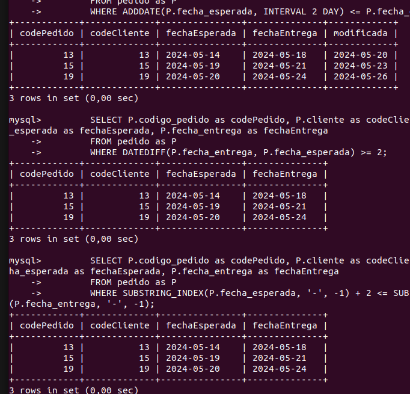

1. Devuelve un listado de todos los pedidos que fueron rechazados en 2009.
    ```SQL
        SELECT P.codigo_pedido as Pedido, P.fecha_pedido as 'Fecha pedido', EP.estado as Estado
        FROM pedido as P
        INNER JOIN estadoPedido AS EP ON P.estado = EP.codigo_estado
        WHERE EP.estado = 'Rechazado' AND SUBSTRING_INDEX(P.fecha_pedido, '-', 1) = '2009';
    ```
    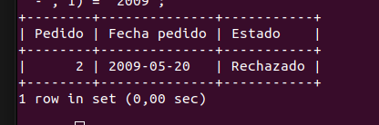

1. Devuelve un listado de todos los pedidos que han sido entregados en el mes de enero de cualquier año.
    ```SQL
        SELECT P.codigo_pedido as codePedido, P.cliente as codeCliente, P.fecha_esperada as fechaEsperada, P.fecha_entrega as fechaEntrega
        FROM pedido as P
        WHERE DATE_FORMAT(P.fecha_entrega, '%m')= 01;
    ```
    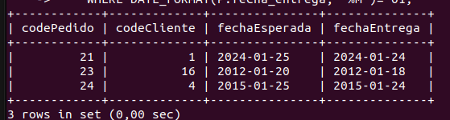

1. Devuelve un listado con todos los pagos que se realizaron en el
año 2008 mediante Paypal. Ordene el resultado de mayor a menor.

    ```SQL
        SELECT *
        FROM pago as PP
        WHERE SUBSTRING_INDEX(PP.fecha_pago, '-', 1) = 2008 AND PP.forma_pago = 'Paypal'
        ORDER BY PP.total desc;
    ```
    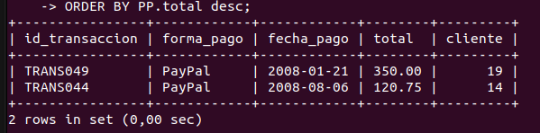

1. Devuelve un listado con todas las formas de pago que aparecen en la
tabla pago. Tenga en cuenta que no deben aparecer formas de pago
repetidas.

    ```SQL
        SELECT DISTINCT P.forma_pago AS 'Forma de pago'
        FROM pago as P;
    ```
    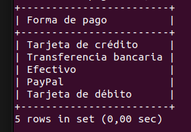

1. Devuelve un listado con todos los productos que pertenecen a la
gama Ornamentales y que tienen más de 100 unidades en stock. El listado
deberá estar ordenado por su precio de venta, mostrando en primer lugar
los de mayor precio.

    ```SQL
        SELECT P.nombre AS Producto, P.precio_venta AS Precio, GP.gama as Gama
        FROM producto AS P
        INNER JOIN gama_producto as GP ON P.gama = GP.codigo_gama
        WHERE GP.gama = 'Ornamentales'
        ORDER BY P.precio_venta desc;
    ```
    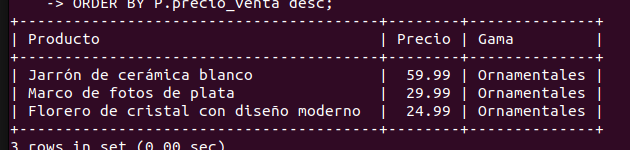

1. Devuelve un listado con todos los clientes que sean de la ciudad de Madrid y cuyo representante de ventas tenga el código de empleado 11 o 30.
    ```SQL
        SELECT C.nombre_cliente as Cliente, CC.nombre_ciudad as Ciudad, C.codigo_empleado_rep_ventas as Representante
        FROM cliente as C
        INNER JOIN ciudad as CC ON C.ciudad = CC.codigo_ciudad
        WHERE CC.nombre_ciudad = 'Madrid' AND C.codigo_empleado_rep_ventas = 10; 
    ```
    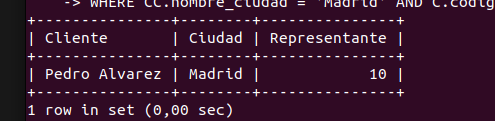

## CONSULTAS MULTITABLA (COMPOSICION INTERNA)
Resuelva todas las consultas utilizando la sintaxis de SQL1 y SQL2. Las consultas con sintaxis de SQL2 se deben resolver con INNER JOIN y NATURAL JOIN.

1. Obtén un listado con el nombre de cada cliente y el nombre y apellido de su representante de ventas.
    ```SQL
        SELECT CC.nombre_cliente as Cliente, CONCAT(E.nombre, ' ', E.apellido1 , ' ', E.apellido2) AS  'Representante de ventas'
        FROM cliente AS CC
        INNER JOIN empleado as E ON CC.codigo_empleado_rep_ventas = E.codigo_empleado;

    ```
    

1. Muestra el nombre de los clientes que hayan realizado pagos junto con el nombre de sus representantes de ventas.
    ```SQL
        SELECT CC.nombre_cliente as Cliente, CONCAT(E.nombre, ' ', E.apellido1 , ' ', E.apellido2) AS  'Representante de ventas', PP.fecha_pago as Pago
        FROM cliente AS CC
        INNER JOIN empleado as E ON CC.codigo_empleado_rep_ventas = E.codigo_empleado
        INNER JOIN pago AS PP ON CC.codigo_cliente = PP.cliente;
    ```
    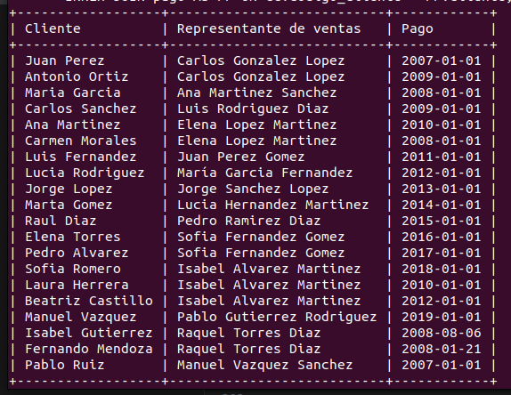

1. Muestra el nombre de los clientes que no hayan realizado pagos junto con el nombre de sus representantes de ventas.
    ```SQL
        SELECT CC.nombre_cliente as Cliente, CONCAT(E.nombre, ' ', E.apellido1 , ' ', E.apellido2) AS  'Representante de ventas', PP.fecha_pago as Pago
        FROM cliente AS CC
        INNER JOIN empleado as E ON CC.codigo_empleado_rep_ventas = E.codigo_empleado
        LEFT JOIN pago AS PP ON CC.codigo_cliente = PP.cliente
        WHERE PP.cliente IS NULL;
    ```
    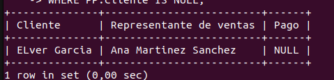

1. Devuelve el nombre de los clientes que han hecho pagos y el nombre de sus representantes junto con la ciudad de la oficina a la que pertenece el representante.
    ```SQL
        SELECT CC.nombre_cliente as Cliente, CONCAT(E.nombre, ' ', E.apellido1 , ' ', E.apellido2) AS  'Representante de ventas',
            C.nombre_ciudad AS 'Ubicacion oficina'
        FROM cliente AS CC
        INNER JOIN empleado as E ON CC.codigo_empleado_rep_ventas = E.codigo_empleado
        INNER JOIN pago AS PP ON CC.codigo_cliente = PP.cliente
        INNER JOIN oficina AS O ON E.codigo_oficina = O.codigo_oficina
        INNER JOIN ciudad AS C ON O.ciudad = C.codigo_ciudad;
    ```
    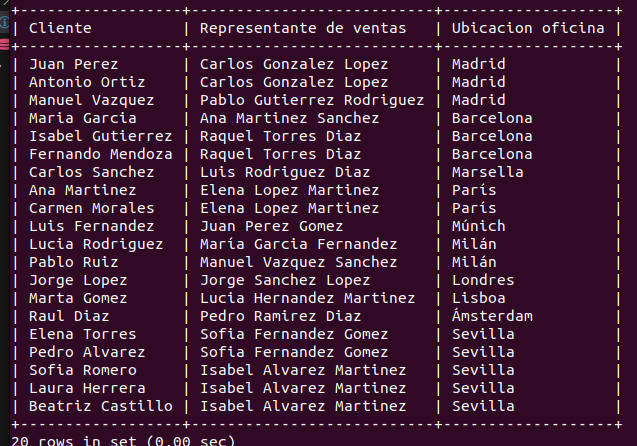

1. Devuelve el nombre de los clientes que no hayan hecho pagos y el nombre de sus representantes junto con la ciudad de la oficina a la que pertenece el representante.
    ```SQL
        SELECT CC.nombre_cliente as Cliente, CONCAT(E.nombre, ' ', E.apellido1 , ' ', E.apellido2) AS  'Representante de ventas',
        C.nombre_ciudad AS 'Ubicacion oficina'
        FROM cliente AS CC
        INNER JOIN empleado as E ON CC.codigo_empleado_rep_ventas = E.codigo_empleado
        LEFT JOIN pago AS PP ON CC.codigo_cliente = PP.cliente
        INNER JOIN oficina AS O ON E.codigo_oficina = O.codigo_oficina
        INNER JOIN ciudad AS C ON O.ciudad = C.codigo_ciudad
        WHERE PP.cliente IS NULL;
    ```
    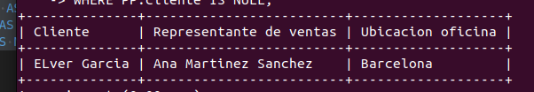

1. Lista la dirección de las oficinas que tengan clientes en Fuenlabrada.
    ```SQL
        SELECT CC.nombre_cliente as Cliente, O.codigo_oficina as Oficina, C.nombre_ciudad as Ciudad,
            CONCAT(ID.linea_direccion1, ' ', ID.linea_direccion2 , ' CP:', ID.codigo_postal) AS  'Direccion oficina'
        FROM cliente AS CC
        INNER JOIN ciudad AS C ON CC.ciudad = C.codigo_ciudad
        INNER JOIN oficina AS O ON C.codigo_ciudad = O.ciudad
        INNER JOIN infoDireccion AS ID ON O.info_direccion = ID.codigo_direccion
        WHERE C.nombre_ciudad = 'Fuenlabrada';
    ```
    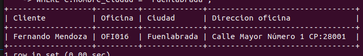

1. Devuelve el nombre de los clientes y el nombre de sus representantes junto
con la ciudad de la oficina a la que pertenece el representante.

    ```SQL
        SELECT CC.nombre_cliente AS Cliente, CONCAT(E.nombre, ' ', E.apellido1  , ' ', E.apellido2) AS 'Vendedor', O.codigo_oficina AS Oficina, C.nombre_ciudad AS Ciudad 
        FROM empleado AS E 
        INNER JOIN cliente AS CC ON E.codigo_empleado = CC.codigo_empleado_rep_ventas 
        INNER JOIN oficina AS O ON E.codigo_oficina = O.codigo_oficina
        INNER JOIN ciudad AS C ON O.ciudad = C.codigo_ciudad;
    ``` 
    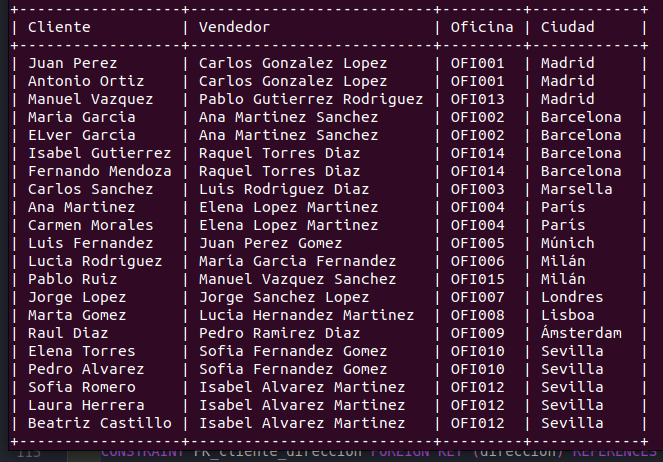

1. Devuelve un listado con el nombre de los empleados junto con el nombre
de sus jefes.

    ```SQL
        SELECT CONCAT(E.nombre, ' ', E.apellido1  , ' ', E.apellido2) AS 'Empleado', (SELECT nombre FROM empleado WHERE codigo_empleado = E.codigo_jefe) AS 'Jefe'
        FROM empleado AS E
        WHERE codigo_jefe != 'NULL';
    ``` 
    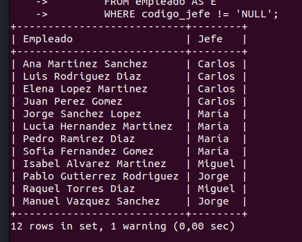

1. Devuelve un listado que muestre el nombre de cada empleados, el nombre
de su jefe y el nombre del jefe de sus jefe.

    ```SQL
        SELECT CONCAT(E.nombre, ' ', E.apellido1  , ' ', E.apellido2) AS 'Empleado', (SELECT nombre FROM empleado WHERE codigo_empleado = E.codigo_jefe) AS 'Jefe', (SELECT nombre FROM empleado WHERE codigo_empleado = 1) AS 'Jefe de los Jefes'
        FROM empleado AS E
        WHERE codigo_jefe != 'NULL';
    ``` 
    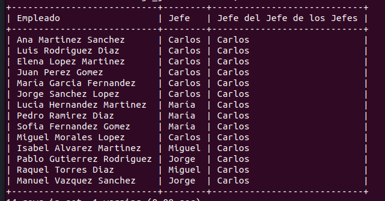

1.  Devuelve el nombre de los clientes a los que no se les ha entregado a
tiempo un pedido.

    ```SQL
        SELECT CC.nombre_cliente as Cliente, P.fecha_entrega AS dateEntrega, P.fecha_esperada AS dateEsperada
        FROM pedido AS P
        INNER JOIN cliente AS CC ON P.cliente = CC.codigo_cliente
        WHERE P.fecha_entrega > P.fecha_esperada;
    ``` 
    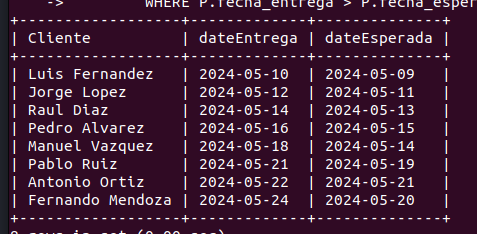

1. Devuelve un listado de las diferentes gamas de producto que ha comprado
cada cliente.

    ```SQL
        SELECT DISTINCT C.nombre_cliente as Cliente, GP.gama AS Gama
        FROM cliente AS C
        INNER JOIN pedido AS PD ON C.codigo_cliente = PD.cliente
        INNER JOIN detalle_pedido as DP ON PD.codigo_pedido = DP.pedido
        INNER JOIN producto AS P ON DP.producto = P.codigo_producto
        INNER JOIN gama_producto AS GP ON P.gama = GP.codigo_gama;
    ``` 
    


## CONSULTAS MULTITABLA (COMPOSICION EXTERNA)
Resuelva todas las consultas utilizando las cláusulas LEFT JOIN, RIGHT JOIN, NATURAL
LEFT JOIN y NATURAL RIGHT JOIN.

1. Devuelve un listado que muestre solamente los clientes que no han
realizado ningún pago.

    ```SQL
        SELECT C.nombre_cliente, P.id_transaccion
        FROM cliente AS C
        LEFT JOIN pago AS P ON C.codigo_cliente = P.cliente
        WHERE P.cliente IS NULL;
    ``` 
    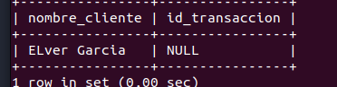

1. Devuelve un listado que muestre solamente los clientes que no han
realizado ningún pedido.

     ```SQL
        SELECT C.nombre_cliente, PD.codigo_pedido
        FROM cliente AS C
        LEFT JOIN pedido AS PD ON C.codigo_cliente = PD.cliente
        WHERE PD.cliente IS NULL;
    ``` 
    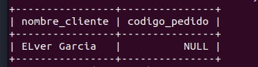

1. Devuelve un listado que muestre los clientes que no han realizado ningún
pago y los que no han realizado ningún pedido.

    ```SQL 
        SELECT C.nombre_cliente, PD.codigo_pedido, P.id_transaccion AS Pedido
        FROM cliente AS C
        LEFT JOIN pedido AS PD ON C.codigo_cliente = PD.cliente
        LEFT JOIN pago AS P ON C.codigo_cliente = P.cliente
        WHERE PD.cliente IS NULL;   
    ``` 
    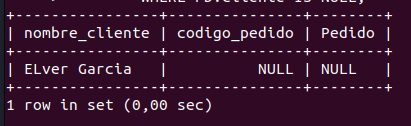

1. Devuelve un listado que muestre solamente los empleados que no tienen
una oficina asociada.

    ```SQL
        SELECT EP.nombre AS 'Empleado sin Oficina', O.codigo_oficina AS oficina
        FROM empleado AS EP
        LEFT JOIN oficina AS O ON EP.codigo_oficina = O.codigo_oficina
        WHERE O.codigo_oficina IS NULL;
    ``` 
    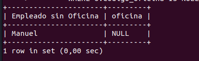

1. Devuelve un listado que muestre solamente los empleados que no tienen un cliente asociado.

    ```SQL
        SELECT EP.nombre AS 'Empleado sin clientes', C.nombre_cliente AS Cliente
        FROM empleado AS EP
        LEFT JOIN cliente AS C ON EP.codigo_empleado = C.codigo_empleado_rep_ventas
        WHERE C.codigo_empleado_rep_ventas IS NULL;
    ``` 
    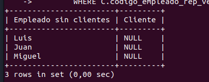

1. Devuelve un listado que muestre solamente los empleados que no tienen un
cliente asociado junto con los datos de la oficina donde trabajan.

    ```SQL
        SELECT EP.nombre AS 'Empleado sin clientes', C.nombre_cliente AS Cliente, O.codigo_oficina AS Oficina, O.ciudad AS Ciudad, CONCAT(D.linea_direccion1, ' ', D.linea_direccion2, ' ', D.codigo_postal) AS Direccion
        FROM empleado AS EP
        LEFT JOIN cliente AS C ON EP.codigo_empleado = C.codigo_empleado_rep_ventas
        INNER JOIN oficina AS O ON EP.codigo_oficina = O.codigo_oficina
        INNER JOIN infoDireccion AS D ON O.info_direccion = D.codigo_direccion
        WHERE C.codigo_empleado_rep_ventas IS NULL;
    ``` 
    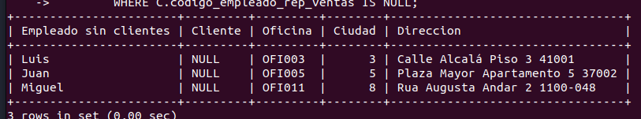

1. Devuelve un listado que muestre los empleados que no tienen una oficina
asociada y los que no tienen un cliente asociado.

    ```SQL
        SELECT EP.nombre AS 'Empleado sin clientes', C.nombre_cliente AS Cliente, EP.codigo_oficina AS oficina
        FROM empleado AS EP
        LEFT JOIN cliente AS C ON EP.codigo_empleado = C.codigo_empleado_rep_ventas
        LEFT JOIN oficina AS O ON EP.codigo_oficina = O.codigo_oficina
        WHERE O.codigo_oficina IS NULL AND C.codigo_empleado_rep_ventas IS NULL;
    ``` 
    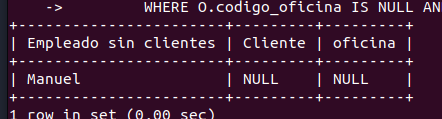

1. Devuelve un listado de los productos que nunca han aparecido en un
pedido.
    ```SQL
        SELECT PD.nombre AS Producto
        FROM producto AS PD
        LEFT JOIN detalle_pedido AS DP ON PD.codigo_producto = DP.producto
        WHERE DP.producto IS NULL;
    ``` 
    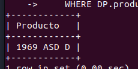

1. Devuelve un listado de los productos que nunca han aparecido en un
pedido. El resultado debe mostrar el nombre, la descripción y la imagen del
producto.

    ```SQL
        SELECT PD.nombre AS Producto, PD.descripcion AS Descripcion, GP.imagen AS Imagen 
        FROM producto AS PD
        LEFT JOIN detalle_pedido AS DP ON PD.codigo_producto = DP.producto
        LEFT JOIN gama_producto AS GP ON PD.gama = GP.codigo_gama
        WHERE DP.producto IS NULL;
    ``` 
    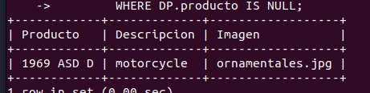

1. Devuelve las oficinas donde no trabajan ninguno de los empleados que
hayan sido los representantes de ventas de algún cliente que haya realizado
la compra de algún producto de la gama Frutales.

    ```SQL
        SELECT DISTINCT O.codigo_oficina AS Oficina
        FROM cliente AS CC
        INNER JOIN empleado AS EE ON CC.codigo_empleado_rep_ventas = EE.codigo_empleado
        INNER JOIN oficina AS O ON EE.codigo_oficina = O.codigo_oficina
        WHERE CC.codigo_cliente NOT IN
        (SELECT P.cliente
        FROM pedido AS P
        INNER JOIN detalle_pedido AS DP ON P.codigo_pedido = DP.pedido
        INNER JOIN producto AS PD ON DP.producto = PD.codigo_producto
        INNER JOIN gama_producto AS GP ON  PD.gama = GP.codigo_gama
        WHERE GP.gama = 'Frutales');
    ``` 
    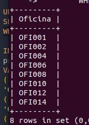
